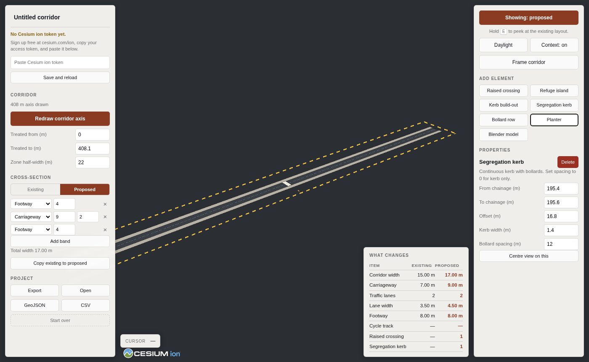

# 3drome — Rome corridor editor

A tool for exploring Rome in 3D and drawing proposed road safety changes into it, in a
way that survives being asked how wide anything is.

Draw a corridor along any street, set its existing and proposed cross-sections, place
safety elements by clicking, and compare the two — over live photorealistic tiles.

The scene is built in two zones with deliberately different accuracy claims: streamed
photorealistic tiles for context, and an **intervention zone** where those tiles are
clipped away and replaced with geometry you authored and can defend. The boundary
between them is always visible on screen.

**Status: prototype.** Anything you draw over photorealistic tiles is dimensioned by you,
not surveyed — the axis is as accurate as your clicks. See
[docs/APPROACH.md](docs/APPROACH.md) for why the tool is shaped this way, the alternatives,
cost and licensing, and what is verified versus assumed.



## Running it

Needs Python. Nothing else, and nothing that requires admin rights.

```bash
python tools/setup_cesium.py     # downloads CesiumJS into app/vendor/cesium
python tools/serve.py            # serves it at http://localhost:8000
```

Then open <http://localhost:8000>. Use `python3` instead of `python` on Linux and macOS.

`python -m http.server 8000 -d app` also works, but `tools/serve.py` sends `no-store`
so a reload always gets what is on disk. A cached `index.html` that still points at a
since-renamed module fails in a way that looks like the whole application is broken, and
that is a bad hour to spend. It also pins the JavaScript MIME type, which some Windows
installations otherwise serve as `text/plain` — browsers refuse to execute that as a
module.

The setup step is a one-off download of about 130 MB, which unpacks to 23 MB. There is a
Node equivalent, `node tools/setup_cesium.mjs`, if you would rather use it — the result
is identical.

If both fail — a proxy, an intercepted certificate, antivirus eating the temporary file —
the manual route always works: download the
[CesiumJS release ZIP](https://github.com/CesiumGS/cesium/releases), unzip it, and copy
the `Build/Cesium` folder from inside it to `app/vendor/cesium`.

CesiumJS is vendored locally rather than loaded from a CDN, because corporate networks
commonly block public CDNs and because it means the application works with no network at
all except for the streamed tiles.

It is **not committed** to the repository — it is 23 MB of third-party build output — so
`app/vendor/cesium/` is empty in a fresh clone and the setup step has to be run once per
copy of the project. If it is missing, the application says so and names the command
rather than failing with a console error.

It has to be served over HTTP. Opening `index.html` from the filesystem will not work:
browsers block ES modules and Cesium's workers over `file://`.

### Photorealistic context

Without a token the application runs in **geometry-only mode**: the design renders, the
context does not. This mode needs no account and no network, and it is the mode the tests
run in.

For photorealistic context, create a free [Cesium ion](https://cesium.com/ion/) account —
Google Photorealistic 3D Tiles are included, so no Google Cloud billing account is
needed — then paste the token into the field the status panel offers when no token is
present. It is kept in the browser on that machine and never written to the repository.

Do **not** put a real token in `app/src/config.js`. That file is tracked by git, so a
token written there gets committed and pushed, and a pushed credential has to be rotated
rather than edited out. The field there exists only for pinning a token in an unattended
deployment.

The Google and Cesium credit line must stay visible when the context is on. It is an
attribution requirement, not decoration.

## Using it

The application opens empty. There is no built-in example design: you draw your own.

**1. Draw the corridor.** Press **Draw corridor axis**, then click the start of the road
and its end. Both clicks land on the photorealistic surface, so the corridor picks up its
ground height from the city rather than from a guess. A starting cross-section is created
with it.

**2. Set the cross-section.** Bands are edited as widths, in order across the corridor —
choose the type, type the width, add or remove bands. Offsets are derived, so the section
always tiles: a gap between bands is not expressible. Switch between **Existing** and
**Proposed** to edit each one; **Copy existing to proposed** gives you a starting point to
modify.

**3. Place elements.** Pick a tool and click. Point elements — raised crossing, refuge
island, kerb build-out, planter, Blender model — take one click. Runs — segregation kerb,
bollard row — take two, and the length is shown while you drag between them. <kbd>Esc</kbd>
cancels.

**4. Adjust.** Click any element to select it. Its properties are generated from the
catalogue with units and ranges, so every dimension is typed rather than dragged into
place. <kbd>Delete</kbd> removes the selection.

| Control | |
|---|---|
| **Showing: proposed / existing** | Switch cross-section |
| Hold <kbd>E</kbd> | Peek at the existing layout, release to return |
| **Daylight / Night** | Move the sun. Night is a working view: it is when lighting and conspicuity get argued about |
| **Context** | Hide the photorealistic tiles without unloading them |
| **Frame corridor** | Return to an oblique view of the whole corridor |
| Move the cursor | Reads out chainage and offset in metres |

The design is saved to the browser as you work and reloads with the page. **Export** writes
a project file you can keep or send; **Open** reads one back. **Start over** clears it.

## Getting the numbers out

**GeoJSON** gives the corridor axis and every element as features carrying their chainage,
offset and dimensions, for QGIS. **CSV** gives both cross-sections band by band with
derived lane widths and totals, for Excel. Both are generated from the same widths the
geometry is drawn from, so figures quoted in a report cannot drift from what is on screen.

## Adding your own models

Anything the catalogue cannot describe belongs in Blender. Author in metres, origin on the
ground, **+Y forward**, export `.glb` into `app/assets/models/`, then place a **Blender
model** element and set its file path in the properties panel. It is rotated to the
corridor automatically.

## Extending the catalogue

A new kind of intervention is one entry in `CATALOG` in `app/src/elements.js`: a label, a
placement mode (`point` or `run`), a list of editable fields with units and ranges, and a
function that returns the geometry. The palette, the properties form, the summary table
and both exports pick it up with no further changes.

## Coordinates

The design is authored in a local East-North-Up frame in metres, anchored at the corridor
origin, and transformed to the globe exactly once at render time. Elements are placed by
chainage and offset rather than longitude and latitude — the terms the design is
dimensioned and reviewed in. `EPSG:4326` appears only in the GeoJSON export.

## Tests

```bash
node tests/smoke.mjs
```

Drives the editor the way a person does — draws an axis, edits the section, places a point
element and a run, edits a dimension through the generated form, cancels a placement,
exports, and reloads to confirm the design was restored. 30 checks. It writes a screenshot
to `tests/output/`.

This is the one part that needs Node, and it is optional — the application itself does
not. On a machine without Node, check a config change by reloading the page and reading
the console: the cross-section validator reports gaps and overlaps there too.

If Playwright's bundled browser is missing, point it at an existing one:

```bash
CHROMIUM_PATH=/path/to/chrome node tests/smoke.mjs
```

## Layout

```
app/
  index.html
  css/app.css
  src/
    config.js      application settings only — no design lives here
    project.js     the editable design: bands, elements, persistence
    geo.js         corridor frame: chainage/offset <-> globe coordinates
    elements.js    the catalogue: geometry plus editable field definitions
    scene.js       viewer, photorealistic context, clipping, rebuild
    editor.js      what a click means: draw axis, place, select
    panels.js      palette, generated properties form, band editor
    app.js         wiring, persistence, exports
    export.js      GeoJSON and CSV output
docs/APPROACH.md   the reasoning behind all of the above
tools/             CesiumJS vendoring
tests/             headless smoke test
```
