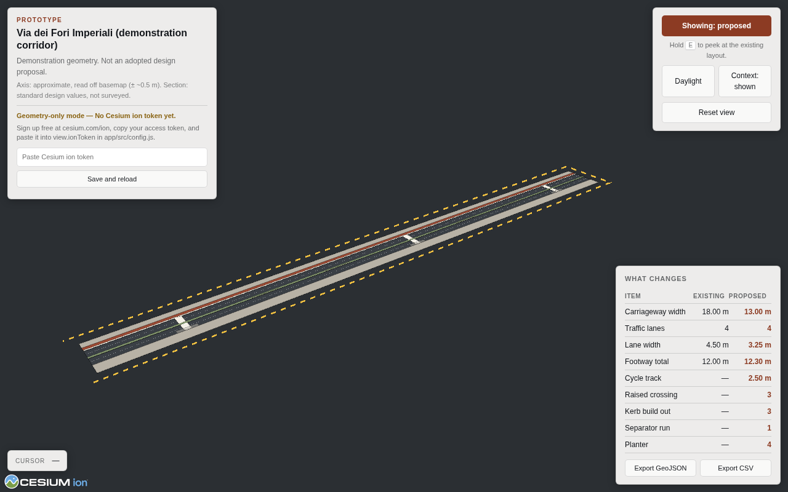

# 3drome — Rome corridor explorer

A prototype for exploring Rome in 3D and putting proposed road safety changes into it,
in a way that survives being asked how wide anything is.

The scene is built in two zones with deliberately different accuracy claims: streamed
photorealistic tiles for context, and an **intervention zone** where those tiles are
clipped away and replaced with geometry you authored and can defend. The boundary
between them is always visible on screen.

**Status: prototype.** The dimensions currently in it are demonstration values, not
survey data. See [docs/APPROACH.md](docs/APPROACH.md), which is the main document here —
it covers why the approach is shaped this way, the alternatives, cost and licensing, and
what is verified versus assumed.



## Running it

Needs Python. Nothing else, and nothing that requires admin rights.

```bash
python tools/setup_cesium.py     # downloads CesiumJS into app/vendor/cesium
python -m http.server 8000 -d app
```

Then open <http://localhost:8000>. Use `python3` instead of `python` on Linux and macOS.

The setup step is a one-off download of about 130 MB, which unpacks to 23 MB. There is a
Node equivalent, `node tools/setup_cesium.mjs`, if you would rather use it — the result
is identical.

If both fail — a proxy, an intercepted certificate, antivirus eating the temporary file —
the manual route always works: download the
[CesiumJS release ZIP](https://github.com/CesiumGS/cesium/releases), unzip it, and copy
the `Build/Cesium` folder from inside it to `app/vendor/cesium`.

CesiumJS is vendored locally rather than loaded from a CDN, because corporate networks
commonly block public CDNs and because it means the application works with no network at
all except for the streamed tiles.

It has to be served over HTTP. Opening `index.html` from the filesystem will not work:
browsers block ES modules and Cesium's workers over `file://`.

### Photorealistic context

Without a token the application runs in **geometry-only mode**: the design renders, the
context does not. This mode needs no account and no network, and it is the mode the tests
run in.

For photorealistic context, create a free [Cesium ion](https://cesium.com/ion/) account —
Google Photorealistic 3D Tiles are included, so no Google Cloud billing account is
needed — then paste the token into the field the status panel offers when no token is
present. It is kept in the browser on that machine and never written to the repository.

Do **not** put a real token in `app/src/config.js`. That file is tracked by git, so a
token written there gets committed and pushed, and a pushed credential has to be rotated
rather than edited out. The field there exists only for pinning a token in an unattended
deployment.

The Google and Cesium credit line must stay visible when the context is on. It is an
attribution requirement, not decoration.

## Using it

| Control | |
|---|---|
| **Showing: proposed / existing** | Switch cross-section |
| Hold <kbd>E</kbd> | Peek at the existing layout, release to return |
| **Daylight / Night** | Move the sun. Night is a working view: it is when lighting and conspicuity get argued about |
| **Context** | Hide the photorealistic tiles without unloading them |
| Move the cursor | Reads out chainage and offset in metres |
| Click | Copies that corridor coordinate to the clipboard, ready to paste into the config |
| **Export GeoJSON / CSV** | Elements for QGIS, cross-section comparison for Excel |

## Changing the design

Everything lives in [`app/src/config.js`](app/src/config.js). No dimension is hard-coded
anywhere else.

- `corridor.axis` — the two endpoints of the road centreline
- `crossSection.existing` / `.proposed` — bands as offsets from the axis, in metres
- `elements` — discrete items placed by chainage and offset

Cross-section bands must tile the corridor without gaps or overlaps; a validator warns on
the console and fails a test if they do not. Lane width is never stated directly — it is
derived from band width and lane count, so there is one number to be wrong about rather
than two that can disagree.

### Adding a Blender model

Author in metres, origin on the ground, **+Y forward**, export `.glb`, then add:

```js
{ id: "shelter-1", type: "model", station: 210, offset: 9.4,
  headingOffset: 0, url: "assets/models/shelter.glb" }
```

It is placed and rotated to the corridor automatically. There is a disabled example slot
in the config.

## Coordinates

The design is authored in a local East-North-Up frame in metres, anchored at the corridor
origin, and transformed to the globe exactly once at render time. Elements are placed by
chainage and offset rather than longitude and latitude — the terms the design is
dimensioned and reviewed in. `EPSG:4326` appears only in the GeoJSON export.

## Tests

```bash
node tests/smoke.mjs
```

Runs the application headless and checks that the scene builds, the corridor lands in
Rome, station/offset round-trips to within a millimetre, the cross-sections tile, the
headline figures are the intended ones, and the toggles and exports work. It writes
screenshots to `tests/output/`.

This is the one part that needs Node, and it is optional — the application itself does
not. On a machine without Node, check a config change by reloading the page and reading
the console: the cross-section validator reports gaps and overlaps there too.

If Playwright's bundled browser is missing, point it at an existing one:

```bash
CHROMIUM_PATH=/path/to/chrome node tests/smoke.mjs
```

## Layout

```
app/
  index.html
  css/app.css
  src/
    config.js      site, cross-sections and elements — the only place dimensions live
    geo.js         corridor frame: chainage/offset <-> globe coordinates
    elements.js    parametric safety elements and cross-section bands
    scene.js       viewer, photorealistic context, clipping, toggles
    ui.js          controls, readout, schedule
    export.js      GeoJSON and CSV output
docs/APPROACH.md   the reasoning behind all of the above
tools/             CesiumJS vendoring
tests/             headless smoke test
```
